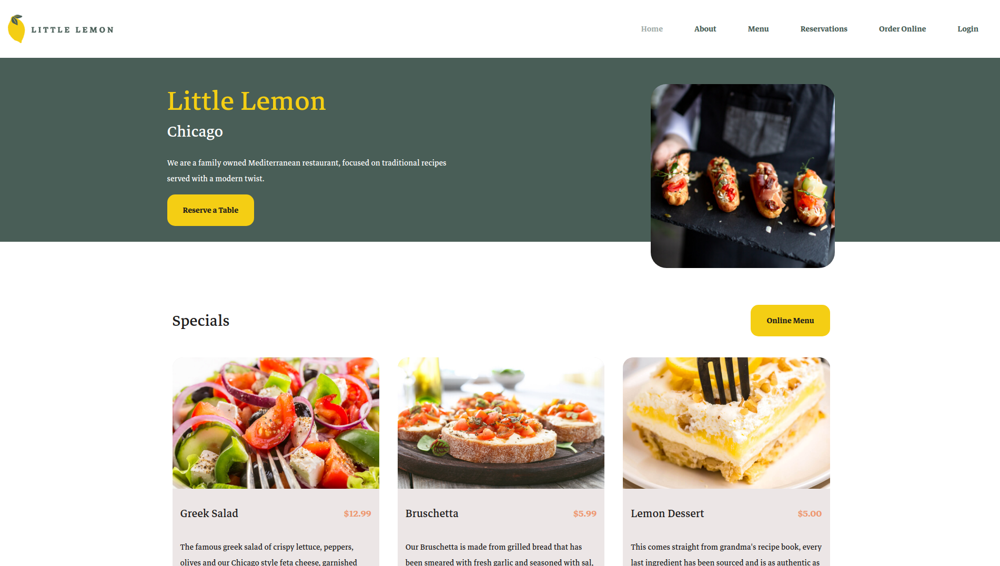

# Meta: Front-End Capstone Project

This repository serves as my personal submission for the [Front-End Capstone Project](https://www.coursera.org/learn/meta-front-end-developer-capstone?specialization=meta-front-end-developer) offered by Meta through Coursera in the [Front-End Developer Professional Certificate](https://www.coursera.org/professional-certificates/meta-front-end-developer).





## Live Demo

[Little Lemon](https://jesusgraterol.github.io/frontend-capstone-project-meta/)


## Project Structure

```
frontend-capstone-project-meta
    │
    src/
    |  ├───assets/
    │  │       └───...
    │  ├───components/
    │  │       └───...
    │  ├───hooks/
    │  │       └───...
    |  └───stylesheets/
    │          └───...
    │
    README.md
```


## Getting Started

```bash
$ cd frontend-capstone-project-meta

$ npm install

$ npm run dev
```


## Running the Tests

```bash
# Run the e2e tests
$ npm run test:e2e

# Run the integration tests
$ npm run test:integration

# Run the unit tests
$ npm run test:unit
```


## Grading Criteria

1. [x] Has the learner followed the design and implementation of the UX UI?
2. [x] Are there appropriate accessibility tags applied?
3. [ ] Does the web app contain unit tests?
4. [ ] Is the booking form functional and applying validation?
5. [x] Are the semantics and responsiveness of the web app correct?
6. [x] Has the learner committed the project to a Git repository?